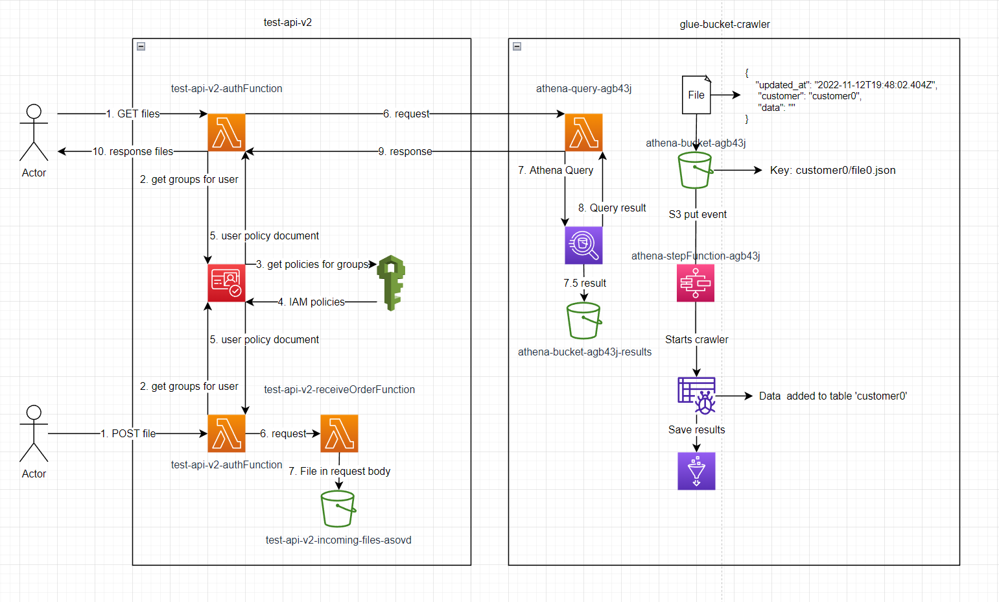

# Setup
deploy glue-bucket-crawler, wait for it to be finished then deploy test-api-v2

execute lambda test-api-v2-create-user with event:

{
  "Username": "customer0",
  "Password": "Password123!",
  "Email": "a@b.com"
}

go to the user in cognito, add them to the group test-api-v2-UserPoolClient-FileGroup

add file to S3 bucket athena-bucket-agb43j/customer0/file.json

Make a GET request to the /File endpoint with the Authorization:
Basic Y3VzdG9tZXIwOlBhc3N3b3JkMTIzIQ==

All elements of the json file will be returned.

supporrted query parameters:
token, updated_at, limit & page

File must contain updated_at timestamp e.g. 2022-11-12T19:48:02.404Z to use the updated_at query parameter.
